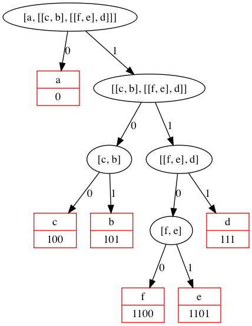

# P50 Huffman code.

First of all, consult a good book on discrete mathematics or algorithms for a detailed description of Huffman codes!

We suppose a set of symbols with their frequencies, given as a list of fr(S,F) terms. Example: [fr(a,45),fr(b,13),fr(c,12),fr(d,16),fr(e,9),fr(f,5)]. Our objective is to construct a list hc(S,C) terms, where C is the Huffman code word for the symbol S. In our example, the result could be Hs = [hc(a,'0'), hc(b,'101'), hc(c,'100'), hc(d,'111'), hc(e,'1101'), hc(f,'1100')] [hc(a,'01'),...etc.]. The task shall be performed by the predicate huffman/2 defined as follows: 

% huffman(Fs,Hs) :- Hs is the Huffman code table for the frequency table Fs

### Example

```
>>> from main import huffman
>>> huffman([['a', 45], ['b', 13], ['c', 12], ['d', 16], ['e', 9], ['f', 5]])
[['a', '0'], ['b', '101'], ['c', '100'], ['d', '111'], ['e', '1101'], ['f', '1100']]
```

* table

	| symbols | frequencies| code  |
	| :-----: | :--------: | ----: |
	| a       | 45         | 0     |
	| b       | 13         | 101   |
	| c       | 12         | 100   |
	| d       | 16         | 111   |
	| e       | 9          | 1101  |
	| f       | 5          | 1100  |

* graph

	
